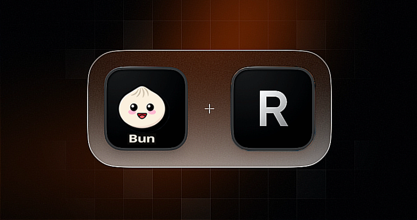

# Envio de E-mail com Bun + Resend




Este projeto encontra exemplo de envio usando Node e Python.


## Como usar a versão em Node?

usando este projeto:

- 1° Faça o download desse projeto

- 2° execute:
```bash
npm install
```

- 3° Execute o script:
```bash
bun index.js
```

Agora o passo a passo fazendo o projeto do 0:

- Use o linux ou um subsistema do linux no windows 10
Instale o unzip:

```bash
sudo apt-get install unzip
```

- iNSTALE O BUN:
```bash
curl -fsSL https://bun.sh/install | bash
```

-Execute:

```bash
source /home/<seu-usuário>/.bashrc 
```

- Veja as opções do bun:
```bash
 bun --help 
```

- Execute a instalação do resend:
```bash
bun install resend
```

- Execute o script:
```bash
bun index.js
```


## Como usar a versão em Python?

- 1° Crie ambiente virtual

```bash
python -m venv venv
```

- 2° Ative ambiente virtual do python

```bash
 source venv/Scripts/Activate
```

- 3° Instale bliblioteca necessária

```bash
pip install resend && pip install python-dotenv && pip install os
```

- 4° coloque o e-mail de destino no arquivo index.py em: 

```bash
"to": "<por-e-mail-de-destino-aqui>",
```

- 5° Execute o script( no windows): 

```bash
python index.py
```

Se retornar no terminal: E-mail enviado com sucesso!, é por que deu certo, só cheque se o e-mail chegou ao endereço de destino.


[Referência](https://www.youtube.com/watch?v=wWQ4gnvS020)